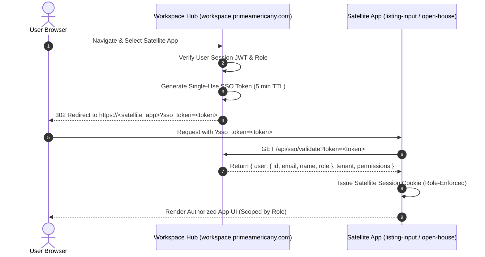

# Roles & Permissions Specification — Prime America Workspace

This document defines the canonical role hierarchy, permission default matrix, and cross-application identity flow across **RE Workspace** and all satellite applications.

---

## 1. Role Hierarchy

User roles are ordered by increasing privilege level:

```
partner (0) < vendor (1) < assistant (2) < salesperson (3) < broker (4) < admin (5)
```

| Role | Weight | Description & Access Scope |
| :--- | :---: | :--- |
| **admin** | `5` | Wildcard full access to all workspace features, satellite apps, system settings, and DB administration. |
| **broker** | `4` | Full access across brokerage CRM, transactions, network, HR, and full company listing edit/publish authority. |
| **salesperson** | `3` | Standard agent access: CRM, transaction pipelines, network connections, brand assets, and edit access to own listing drafts. Read-only for company listings. |
| **assistant** | `2` | Administrative support: Read access to CRM, listings, network, and assigned open house guest rosters. |
| **vendor** | `1` | External service provider: Scoped access to vendor directory and network referral tasks. |
| **partner** | `2` | External partner: Scoped access to property listings and directory exchanges. |

---

## 2. Shared Code Contracts

### Primary Helper Module
- **File**: [`worker/lib/roles.ts`](file:///Users/siddharthalama/dev/real-estate/worker/lib/roles.ts)
- **Exports**:
  - `UserRole`: TypeScript union type of valid roles.
  - `ROLE_HIERARCHY`: Ordered array of roles.
  - `roleAtLeast(role: string, minimum: UserRole): boolean`: Returns `true` if `role` meets or exceeds `minimum`.
  - `assertRole(role: string, minimum: UserRole): void`: Throws an exception if `role` does not meet `minimum`.

---

## 3. Cross-Application SSO & Role Flow



---

## 4. Satellite Application Enforcement Contracts

1. **Inventory Admin (`dev/listing-input`)**:
   - `requireRole('salesperson')` on listing creation & draft edits.
   - `requireRole('broker')` / `roleAtLeast('broker')` for company-wide edits and hard deletion.
2. **Open House Portal (`dev/open-house`)**:
   - Admins & Brokers: Manage all open house events and visitor lead rosters.
   - Salespersons: Manage own created open houses.
   - Assistants: Read-only guest roster for assigned events.
3. **Branding & Marketing Hub (`dev/branding hub`)**:
   - Admins/Brokers: Manage brand asset catalog & templates.
   - Salespersons: Access & download personalized agent marketing materials.
4. **Company Brain (`company-brain`)**:
   - Admins/Brokers: Full publication & edit permissions for policies.
   - Salespersons: Read-only access to published policies and training guides.
